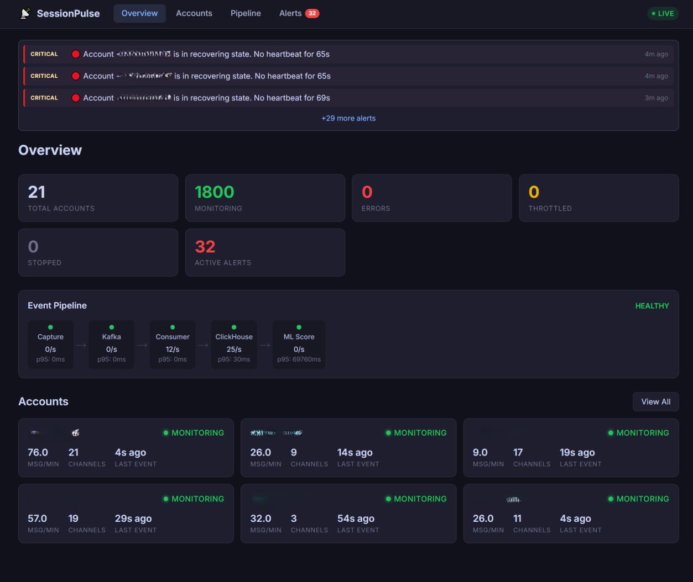

# SessionPulse

**Domain-aware observability for session-based distributed systems.**

SessionPulse replaces generic monitoring (Grafana/Prometheus) with a purpose-built observability platform that understands your application's domain: account lifecycles, session health, subscription status, and event pipeline metrics.



## Components

| Component | Description | Port |
|-----------|-------------|------|
| [session-pulse-sdk](./session-pulse-sdk/) | Python SDK (zero-dep core) | - |
| [session-pulse-server](./session-pulse-server/) | Aggregator + REST API + WebSocket | 8500 |
| [session-pulse-dashboard](./session-pulse-dashboard/) | SvelteKit real-time dashboard | 5100 |

## Architecture

```
Your Services (with SDK)         SessionPulse
========================         ============

 +-----------+
 | backend   |--+
 | + SDK     |  |     +------------------+     +-------------+
 +-----------+  |---->| Kafka/Redpanda   |---->| SP Server   |
 | bot-client|  |     | (observability_  |     | - State     |
 | + SDK     |--+     |  events topic)   |     |   Machine   |
 +-----------+  |     +------------------+     | - Metrics   |
 | worker    |--+                              | - Alerts    |
 | + SDK     |                                 | - API       |
 +-----------+                                 +------+------+
                                                      |
                                               +------v------+
                                               | Dashboard   |
                                               | (SvelteKit) |
                                               +-------------+
                                                      |
                                               +------v------+
                                               | ClickHouse  |
                                               | (telemetry) |
                                               +-------------+
```

## Quick Start

### 1. Add SDK to your service

```python
from session_pulse import SessionPulse, AccountState

pulse = SessionPulse(
    service_name="my-service",
    transport="kafka",
    kafka_bootstrap="redpanda:9092",
)
await pulse.start()

pulse.account_state(phone, AccountState.MONITORING)
pulse.counter("messages", "account", phone)
```

### 2. Start the server and dashboard

```yaml
# docker-compose.yml
services:
  session-pulse:
    build: ./session-pulse-server
    ports: ["8500:8500"]
    environment:
      - CLICKHOUSE_HOST=clickhouse
      - KAFKA_BOOTSTRAP=redpanda:29092
      - KAFKA_TOPIC=observability_events

  session-pulse-dashboard:
    build: ./session-pulse-dashboard
    ports: ["5100:3000"]
```

```bash
docker compose up session-pulse session-pulse-dashboard
```

Open **http://localhost:5100**.

## Features

### Account State Machine (10 states)

```
CREATED -> CONNECTING -> CONNECTED -> MONITORING
                                       |- THROTTLED (auto-resume)
                                       |- RECOVERING (auto-detect)
                                       |- STOPPED
                                       |- ERROR -> CONNECTING
                                       |- BANNED (terminal)
```

- Automatic timeout detection (no heartbeat > 60s = RECOVERING)
- FloodWait auto-tracking with countdown
- Terminal state enforcement (BANNED blocks all exits)

### Real-Time Dashboard

- Account grid with state indicators
- Event timeline per account
- Pipeline flow visualization (Capture -> Kafka -> Worker -> ClickHouse -> ML)
- Alert management with acknowledge

### Alerting Engine

- YAML-configurable rules
- FOR-duration conditions (alert after N seconds)
- Metric-based rules (consumer lag, error rates, latency)
- Comparison operators: `==`, `!=`, `in`, `contains`, `>`, `<`, `>=`, `<=`
- Telegram notifications with severity formatting
- Auto-resolve when condition clears
- Anomaly detection baseline (3-sigma)
- Rule CRUD via REST API + UI

### SDK Design

- **Zero-impact**: emit() is O(1), never blocks, never raises
- **Circuit breaker**: 5 failures -> OPEN, 60s recovery
- **Ring buffer**: 10K event overflow protection
- **Payload sanitization**: auto-strips `session_string`, `api_hash`, `password`
- **Framework integrations**: Quart, Aiogram 3.x (auto-instrumentation)

## API Reference

```
GET  /api/v1/accounts                  All accounts + state + metrics
GET  /api/v1/accounts/{phone}/state    Single account
GET  /api/v1/accounts/{phone}/timeline Event history
GET  /api/v1/pipeline/health           Pipeline health by stage
GET  /api/v1/alerts                    Active + historical alerts
POST /api/v1/alerts/{id}/acknowledge   Acknowledge alert
GET  /api/v1/alerts/rules              List rules
POST /api/v1/alerts/rules              Create rule
GET  /api/v1/anomalies                 Detected anomalies
GET  /api/v1/system/overview           System summary
GET  /healthz                          Liveness
GET  /readyz                           Readiness
GET  /metrics                          Prometheus-compatible
WS   /api/v1/ws/accounts              Real-time state changes
WS   /api/v1/ws/alerts                Real-time alerts
WS   /api/v1/ws/timeline/{phone}      Real-time account events
```

## Requirements

- Python 3.10+ (SDK), 3.11+ (Server)
- ClickHouse 24+
- Kafka/Redpanda (or HTTP transport for small setups)
- Bun (Dashboard build)

## License

MIT
